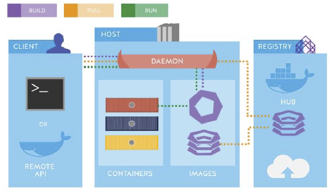

# Docker Hands-On Tutorial

Here you will learn the core foundations of containerization by building, testing, and running apps like Python and Java alongside a PostgreSQL database using essential Docker CLI commands. 

You will also cover Dockerfile best practices, database initialization scripts, and custom image builds—setting the stage for multi-container orchestration.

https://www.docker.com/products/docker-hub/


### Colima
We are going to use Colima locally in our OS, Colima is a container runtime for macOS (and Linux) with minimal setup. It supports Docker, Containerd, and Kubernetes out of the box.

https://colima.run/docs/getting-started/


## Introduction

Docker is an open-source platform that automates the deployment, scaling, and execution of applications inside lightweight, software-enforced containers. It virtualizes the host operating system kernel, bundling application code, runtime environments, system libraries, and configuration files into standardized, portable artifacts called **OCI (Open Container Initiative) Images**.

## Components

* **Docker Daemon (`dockerd`):** The persistent background service running on the host that listens for Docker API requests. It manages images, containers, networks, and storage volumes.
* **Docker CLI (`docker`):** The command-line interface used by engineers to interact with the daemon via REST API calls.
* **Docker Registry (e.g., Docker Hub, AWS ECR):** A centralized or private store for publishing, versioning, and distributing container images.
* **`containerd` & `runc`:** Low-level container runtimes. `containerd` manages the full container lifecycle (pulling images, execution management), while `runc` acts as the lightweight CLI tool for spawning containers according to the OCI specification using Linux kernel `namespaces` and `cgroups`.

## 2.  Architecture Diagram



## Image Layers Work 

Docker images are structured as a stack of read-only intermediate layers. Each instruction in a `Dockerfile` (`FROM`, `COPY`, `RUN`, `ENV`) creates a distinct, immutable filesystem layer stored as a SHA-256 hash digest.
```
+-----------------------------------------------+
   | Container Layer (Read/Write)                  | <- Ephemeral Runtime Data
   +-----------------------------------------------+
   | Layer 4: ENTRYPOINT ["python", "app.py"]     | <- Read-Only Image Layer
   +-----------------------------------------------+
   | Layer 3: COPY app.py .                        | <- Read-Only Image Layer
   +-----------------------------------------------+
   | Layer 2: RUN pip install -r requirements.txt   | <- Read-Only Image Layer
   +-----------------------------------------------+
   | Layer 1: FROM python:3.10-slim                | <- Base OS Kernel Interface
   +-----------------------------------------------+
```

## Key Principles

1. **Layer Immutability & Caching:**
   When rebuilding an image (`docker build`), Docker checks if host files match cached layers. If `requirements.txt` has not changed, Docker reuses Layer 2 from the cache, bypassing `pip install` entirely and accelerating build speeds.
2. **Copy-on-Write (CoW) Driver:**
   When a container is instantiated via `docker run`, Docker mounts a thin, writable **Container Layer** on top of the stack. If a process inside the container modifies a file located in a read-only lower layer, the Storage Driver (e.g., `overlay2`) copies the file up to the writable container layer before applying changes.
3. **Storage Efficiency:**
   Multiple running containers derived from the same base image share identical read-only layers in memory and disk storage, incurring zero duplication overhead.

## Reference Matrix

| Concept | Description | Lifecycle / Scope | Primary Command Example |
| :--- | :--- | :--- | :--- |
| **Dockerfile** | Plain-text specification defining instructions to build an image. | Build Time | `vim Dockerfile` |
| **Image** | An immutable, read-only stack of layers containing runtime binaries and code. | Static Artifact | `docker build -t app:v1.0 .` |
| **Container** | A runnable instance of an image executing isolated processes on the host. | Ephemeral Runtime | `docker run -d -p 5000:5000 app:v1.0` |
| **Volume** | Host-managed persistent storage decoupled from container lifecycle. | Persistent Storage | `docker volume create app-data` |
| **Bind Mount** | Direct mapping of a host filesystem path into a container path. | Live Development | `docker run -v $(pwd):/app app:v1.0` |
| **Network** | Software-defined network providing DNS name resolution between containers. | Virtual Bridge | `docker network create movie-net` |
| **Registry** | Centralized distribution server storing and versioning container images. | Distribution | `docker push repo/app:v1.0` |
