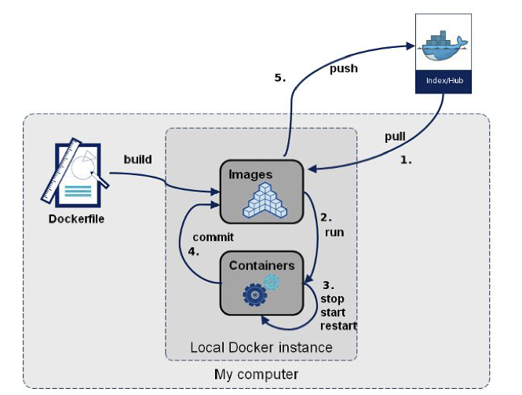

# DockerHub

Now we are going to use commands that will run a database container, then we are going to inspect schemas, execute SQL queries, and manipulate live data in real time. Using tools like docker exec and native CLI clients like psql, you can seamlessly manage containerized databases without installing local database engines.



## Postgres plain container
```
docker pull postgres

docker run -d --name postgresNoTag -p 5432:5432 postgres

docker ps -f name=postgresNoTag

docker logs postgresNoTag

docker rm -f postgresNoTag
```

## 1. Postgres 9.5 configured container
```
docker run -d \
  --name postgres-db \
  -p 5432:5432 \
  -e POSTGRES_USER=userDB \
  -e POSTGRES_PASSWORD=passDB \
  -e POSTGRES_DB=postgres \
  postgres:9.5

docker exec -i postgres-db psql -U userDB -d postgres -c "SELECT version();"

docker exec -it postgres-db psql -U userDB -d postgres -c "\l"

docker exec -it postgres-db psql -U userDB -d postgres -c "\dt"
```

## 2. Verification & Testing Commands
```
docker ps -f name=postgres-db

docker logs postgres-db
```

## 3. Init the database
```
docker cp script/init.sql postgres-db:/tmp/init.sql

docker exec -it postgres-db bash

cat /tmp/init.sql

docker exec -it postgres-db psql -U userDB -d postgres -f /tmp/init.sql

docker exec -it postgres-db psql -U userDB -d postgres -c "SELECT * FROM internsdb;"

docker exec -it postgres-db rm /tmp/init.sql
```

## 4. Update externally the database
```
docker exec -i postgres-db psql -U userDB -d postgres < script/update.sql

docker exec -it postgres-db psql -U userDB -d postgres -c "SELECT * FROM internsdb;"
```

## 4. Database Logs & Inspection
```
docker stop postgres-db && docker rm postgres-db
```